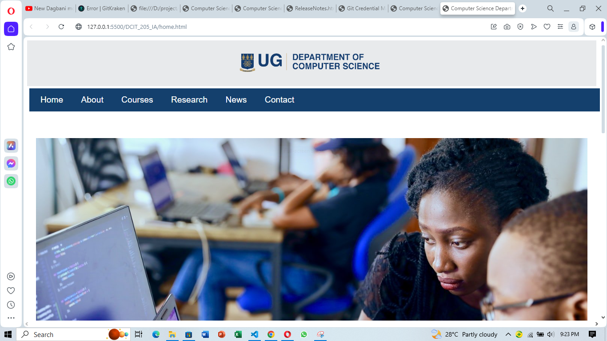

# DCIT_205_IA
This is a Website for Computer Science Department in University of Ghana
This Website is meant to give an insight to aspirant computer science students and the IT student. The website is desighned to tell the students what at least all the information that they will need in order to fit in the department without or with at least less challenges.

1. open your terminal and locate the folder that you want to clone the repository
2. Type git clone https://github.com/Sadiqgh/DCIT_205_IA.git
3. Navigate in to the folder where the repository was cloned.
YUSSIF ABUBAKARI SADIQ 11313800
[!contact](screenshots/contact.PNG)!
[!course](screenshots/courses.PNG)
[!About page](screenshots/about.PNG)
[!news](screenshots/news.PNG)
[!research](screenshots/research.PNG)
[!short](screenshots/short.PNG)!
[!home page](screenshots/home.PNG)

